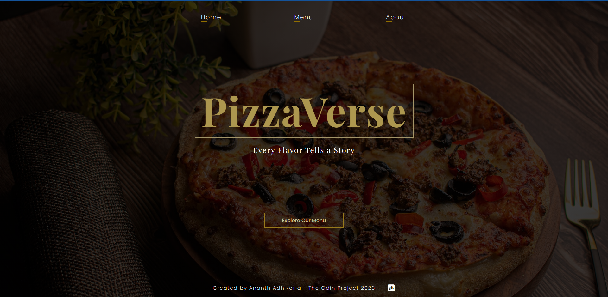

# Restaurant Page

Objectives of assignment (The odin project) to 
1) Learn Webpack and set up dev and prod configs and various asset management
2) Learn to use SASS / SCSS
3) Learn to make a SPA application while only rendering the Center element and not changing other dom elements using javascript

[Click here to try it live...](https://ananth-adhikarla.github.io/Restaurant-Page/)

---

